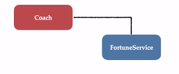

## Learning Spring Inversion of control and Dependency Injection concept.

#Autowired Coach Interface with Fortune service Interface

@Qualifier to specify unique bean id 
@Scope to specify the scope of object.(By default scope is Singleton)